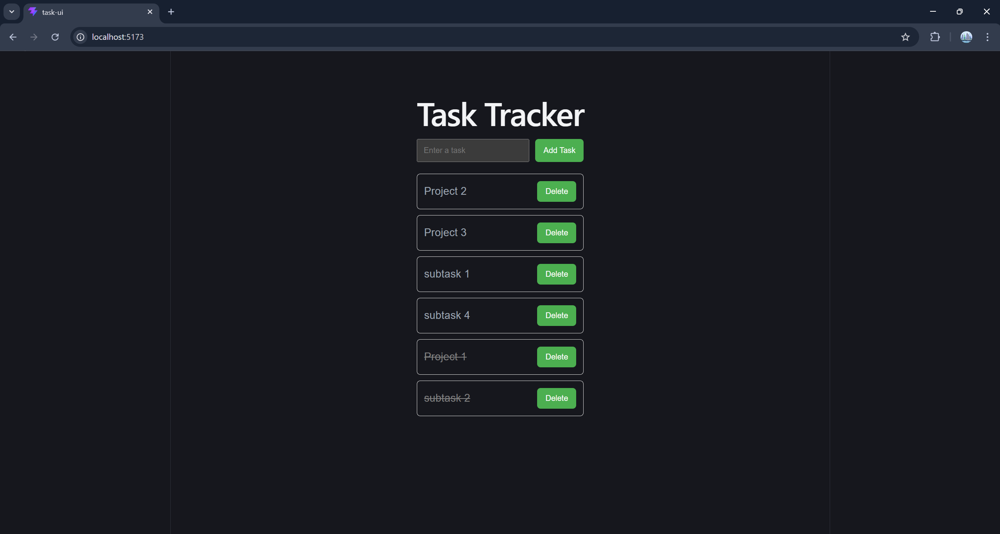

# Task Tracker

Full-stack task management application built with ASP.NET Core, React, and PostgreSQL.

## Features

* Create, update, and delete tasks
* Toggle task completion status
* RESTful API with persistent storage
* Responsive frontend with real-time updates

## Tech Stack

### Backend

* ASP.NET Core Web API (.NET 10)
* Entity Framework Core
* PostgreSQL

### Frontend

* React
* Vite
* Axios

## Getting Started

### 1. Run Backend

cd TaskApi
dotnet run

### 2. Run Frontend

cd task-ui
npm install
npm run dev

## API Endpoints

| Method | Endpoint       | Description     |
| ------ | -------------- | --------------- |
| GET    | /api/task      | Get all tasks   |
| GET    | /api/task/{id} | Get task by ID  |
| POST   | /api/task      | Create new task |
| PUT    | /api/task/{id} | Update task     |
| DELETE | /api/task/{id} | Delete task     |

## Screenshot

